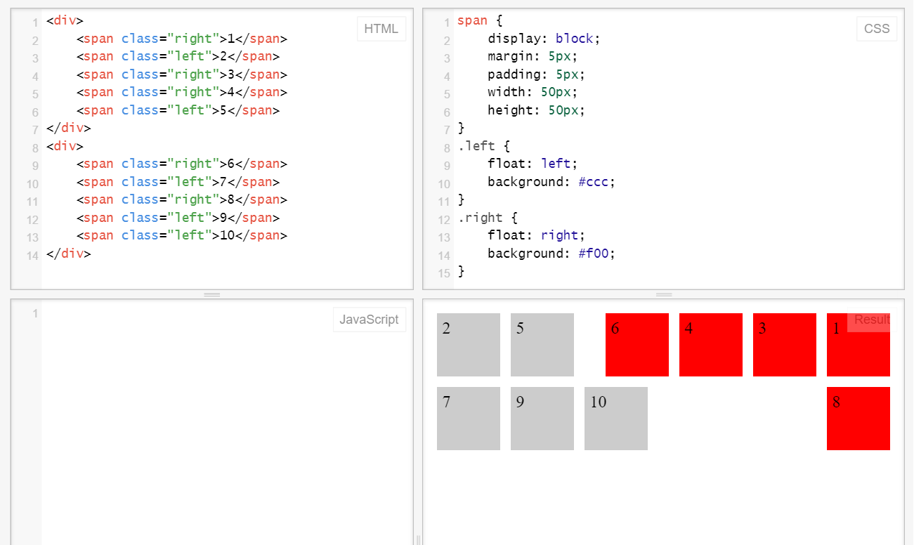
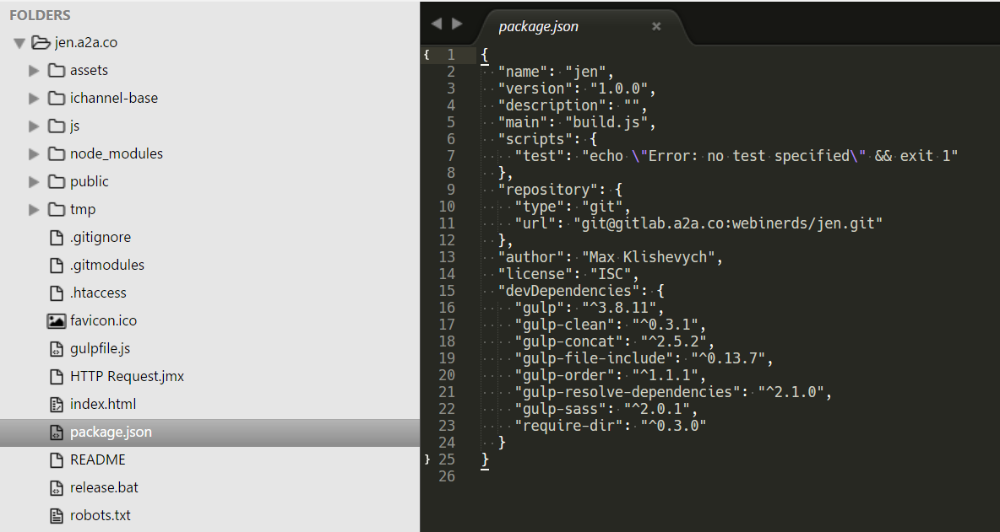

#Table of Contents

- **[Emmet](#emmet)**
- **[Pre- and Post- processors](#pre--and-post--processors)**
- **[Responsive CSS Framework](#responsive-css-framework)**
- **[CSS float property](#css-float-property)**
- **[CSS position property](#css-position-property)**
- **[Adaptive design and layout](#adaptive-design-and-layout)**
- **[Project Builders](#project-builders)**
- **[CSS](#css)**
- **[HTML](#html)**
- **[Links](#links)**

#Emmet
[Emmet](http://docs.emmet.io) (предыдущее название — Zen Coding) — это набор плагинов для различных популярных текстовых редакторов, используемых для скоростного написания HTML и CSS кода.

#### ! => TAB


```html
<!DOCTYPE html>
<html lang="en">
<head>
	<meta charset="UTF-8">
	<title>Document</title>
</head>
<body>
	
</body>
</html>
```

#### div+div>p>span+em^bq => TAB


```html
<div></div>
<div>
    <p>
      <span></span>
      <em></em>
    </p>
    <blockquote></blockquote>
</div>
```

#### ul.generic-list>lorem5.item*4 => TAB


```html
<ul class="generic-list">
	<li class="item">Lorem ipsum dolor sit amet.</li>
	<li class="item">Illum corrupti, non earum voluptatum.</li>
	<li class="item">Eius unde blanditiis et eligendi!</li>
	<li class="item">Quasi sequi maxime accusamus nesciunt!</li>
</ul>
```
# Pre- and Post- processors
**[Table of Contents](#table-of-contents)**

### Pre-processors
[SASS](http://sass-lang.com) (Syntactically Awesome Stylesheets) — модуль, включенный в Haml. Sass — это метаязык на основе CSS, предназначенный для увеличения уровня абстракции CSS кода и упрощения файлов каскадных таблиц стилей.

[LESS](http://lesscss.org) — это динамический язык стилей, который разработал Alexis Sellier. Он создан под влиянием языка стилей Sass, и, в свою очередь, оказал влияние на его новый синтаксис «SCSS», в котором также использован синтаксис, являющийся расширением СSS.

[SASS vs LESS (Habrahabr post)](http://habrahabr.ru/post/144309)

### Post-processor
[PostCss](https://github.com/postcss/postcss) - это инструмент, для изменения Css с помощью JavaScript. Это нечто большее чем простой пост-процессор, но и немного не то, чем являются препроцессоры.

##SCSS (синтаксис SASS)
### Вложенность
SCSS
```scss
#some {
  border: 1px solid red;
  .some { background: white; }
}
```
CSS
```css
#some {
  border: 1px solid red;
}
#some .some {
  background: white;
}
```
### Переменные и операции с ними
SCSS
```scss
$blue: #3bbfce;
$margin: 16px;
$url: url(../img/icons/ui-ios-sprite.png);

.content-navigation {
  border-color: $blue;
  color: darken($blue, 9%);
}
.border {
  padding: $margin / 2;
  margin: $margin / 2;
  border-color: $blue;
}
.wrapper {
  background: $url;
}
```
CSS
```css
.content-navigation {
  border-color: #3bbfce;
  color: #2ca2af;
}
.border {
  padding: 8px;
  margin: 8px;
  border-color: #3bbfce;
}
.wrapper {
  background: url(../img/icons/ui-ios-sprite.png);
}
```
### Подключение других scss файлов
SCSS
```scss
@import "./core/variables";
@import "./core/mixin";
@import "./core-project/variables";
```

### Миксинны
Переменные в миксинах поддерживают default значания.
SCSS
```scss
@mixin text-truncate {
  overflow: hidden;
  text-overflow: ellipsis;
  white-space: nowrap;
}
@mixin transition( $transition-property, $transition-time, $transition-method:  ease) {
  -webkit-transition: $transition-property $transition-time $transition-method;
  -moz-transition: $transition-property $transition-time $transition-method;
  -ms-transition: $transition-property $transition-time $transition-method;
  -o-transition: $transition-property $transition-time $transition-method;
  transition: $transition-property $transition-time $transition-method;
}

.block-wrap {
  .block {
    @include text-truncate;
  }
  @include transition(all, .2ms);
}
```
CSS
```css
.block-wrap {
  -webkit-transition: all 0.2ms ease;
  -moz-transition: all 0.2ms ease;
  -ms-transition: all 0.2ms ease;
  -o-transition: all 0.2ms ease;
  transition: all 0.2ms ease;
}
.block-wrap .block {
  overflow: hidden;
  text-overflow: ellipsis;
  white-space: nowrap;
}
```
### Наследование
SCSS
```scss
%extend_1 {
  display: inline-block;
}
%extend_2 {
  @extend %extend_1;
  width: 34px;
  height: 19px;
}
.wrap {
  @extend %extend_1;
  .block {
    @extend %extend_2;
  }
}
```
CSS
```css
.wrap,
.wrap .block {
  display: inline-block;
}
.wrap .block {
  width: 34px;
  height: 19px;
}
```

#Responsive CSS Framework
**[Table of Contents](#table-of-contents)**

[Bootstrap](http://getbootstrap.com) — подходит для быстрого прототепирования веб интерфейсов, чему способствует множество готовых элементов, таких как кнопки, поля, воодов, менюшки и т.п

[Zurb Foundation](http://foundation.zurb.com) - меньше шаблонных элементов, но больше заточен на кросплатформенные и адаптивные сайты.

Использование какой-либо адаптивной сетки сильно упрощает жизнь при разработке адаптивных сайтов и приложений.
Адаптивные сетки у обоих фреймворков достаточно хороши, но у Зурба более осмысленно названы классы.
Расширенное сравнение фреймвороков можно посмотреть на [responsive.vermilion.com](http://responsive.vermilion.com/compare.php)

###Принципы работы сеток на примере Zurb Foundation

Zurb Foundation is mobile-first - фраза с их сайта. Это означает, что, с точки зрения кода, разрабатывается сначала мобильная версия, и после этого добавляются стили для более широких устройств. 

Desktop-first - это обратный подход, код пишется сразу под большие расширения, и при уменьшении экрана свойства переопределяются.

```html
<div class="row">
  <div class="small-12 medium-6 large-3 column">...</div>
  <div class="small-12 medium-6 large-3 column">...</div>
  <div class="small-12 medium-6 large-3 column">...</div>
  <div class="small-12 medium-6 large-3 column">...</div>
</div>
```

CSS сетки принято делать 12-ти колоночными. 

У блока обертки, в данном случае .row, применены стили clearfix.

У .column - float:left; что позволяет выстроить их в линию.

А классы .small-12 .medium-6 .large-3 отвечают за ширину блоков на определенном разрешении.

Определение где граница между small, medium и large находятся в SASS переменных в самом Zurb. При желании их можно переопределить.

```css
.small-12 {width: 100%}
.medium-6 {width: 50%}
.large-3 {width: 25%}
```

Число после названия класса говорит о том, сколько колонок из 12 по ширине должен занять этот блок.
Весь css, который нужен для корректной работы и есть фреймворк, вам остается только правильно использовать классы.

#CSS float property
**[Table of Contents](#table-of-contents)**

```css
float: left | right | none | inherit;
```

- При позиционировании элементы вынимаются из потока и сдвигается влево/вправо до того как коснётся либо границы родителя, либо другого элемента с float.
- Если пространства по горизонтали не хватает для того, чтобы вместить элемент, то он сдвигается вниз до тех пор, пока не начнёт помещаться.
- Все элементы в потоке, кроме других float и inline-элементов, ничего не знают о позиционировании и физических размерах float элемента
- При присваивании элементу float он автоматически получает display:block. Что означает, что все float элементы могут принимать свойства ширины и высоты. Исключением являются элементы display:inline-table, они не становятся display:block.
- Если есть картинка с display:float и текст возле нее, то текст ее обтекает. Все бы хорошо, мы получили, что и хотели, но тут есть пакость, картинку обтекает Текст внутри элемента, а не сам элемент.

Направление float потока



```css
clear: none | left | right | both | inherit;
```

Применение этого свойства сдвигает элемент вниз до тех пор, пока не закончатся float элементы слева/справа/с обеих сторон.

Добавляя это свойство мы, конечно же, сможем сдвинуть float элементы, так как мы задумали, но появляется проблема, clear сдвигает элемент в потоке ровно на стролько, сколько нужно для того, что бы следующий элемент находился под предыдущим. При этом сдвиге не учитывается margin сдвигаемого блока.


Данная проблема решается добавлением элемента в DOM между испытуемыми:

```html
<div style="clear:both"></div>
```

Но, как вы понимаете, наличия пустых и не функциональных элементов в DOM это совсем не хорошо.

Есть более красивое решение - отдельный класс для элементов, которым нужен clear, который бы добавил в DOM превдоелемент:

```css
.clearfix:after {
  content: ".";
  display: block;
  clear: both;
  visibility: hidden;
  height: 0;
}
```

#CSS position property
**[Table of Contents](#table-of-contents)**

```css
position: static | relative | absolute | fixed | inherit;
```

####position: static

Это стандартное свойство, которое присваевается элементу если у него не задан другой position

####position: relative

Дает элементу возможность быть позиционированным. Сдвиг элемента происходит с того места, в котором он находился перед позиционированием. Эго физические размеры остаются неизменными и присутствуют в потоке.

####position: absolute

- Элемент исчезает с того места, где он должен быть и позиционируется заново. Остальные элементы, располагаются так, как будто этого элемента никогда не было.
- Координаты top/bottom/left/right для нового местоположения отсчитываются от ближайшего позиционированного родителя, т.е. родителя с позиционированием, отличным от static. Если такого родителя нет — то относительно документа.
 
Одна из распространенных ошибок это попытка растянуть position: absolute на всю ширину страници:

```css
div {
  position: absolute;
  left: 0; top: 0;
  width: 100%; height: 100%;
}
```

Это работает ровно до того момента, когда появляется скролл на странице. Так как width и height у position: absolute элемента отсчитывается не от размера документа, а от размера окна, т.к он выпал из потока.

####position: fixed

Позиционирует элекмент точно так же, как absolute, но относительно window.

Если position: fixed элекмент позиционировать сверху страници, то при прокрутке документа, он онстанется на том же месте относительно window.

#Adaptive design and layout
**[Table of Contents](#table-of-contents)**

####Фиксированная верстка

Oтличается среди других видов html верстки четко определенными размерами элементов - элементы веб-страницы соответственно имеют фиксированные размеры, в пикселях.

####Резиновая верстка

Отличается от фиксированной верстки относительными размерами элементов веб-страницы, обычно заданных в процентах

####Адаптивная верстка

Суть этой верстки в том, чтобы сверстанная веб-страница хорошо отображалась на экранах устройств разного размера, например, смартфон, планшет, монитор компьютера

####Проблема масштабирования в мобильных браузерах

Иногда мобильные браузеры могут игнорировать адаптивную верстку и просто уменьшать контент до тех пор, пока он не влезит в экран по ширине. Что бы избавится от этой проблемы нужно использовать:

```html
<meta name="viewport" content="width=device-width, initial-scale=1.0">
```

Иногда может понадобится запретить пользователю увеличивать контент, для этого есть дополнительное свойство:

```html
<meta name="viewport" content="width=device-width, initial-scale=1.0, maximum-scale=1.0, user-scalable=no">
```

C помощью свойства @media можно указать для каких устройств и с каким разрешаением будут применяться стили.

```css
@media [not|only] mediatype and (media feature) {
    CSS-Code;
}
```

Типов на данный момент не так много:

- all - Все типы. Это значение используется по умолчанию.
- print - Печатающие устройства вроде принтера.
- screen - Экран устройства.
- speech - Устройство, которое выводит информацию "голосом"

Типы, которые вывели из документации (Deprecated):

- aural - Речевые синтезаторы, а также программы для воспроизведения текста вслух. Сюда, например, можно отнести речевые браузеры.
- braille - Устройства, основанные на системе Брайля, которые предназначены для слепых людей.
- handheld - Наладонные компьютеры и аналогичные им аппараты.
- projection - Проектор.
- tty - Устройства пито информационное табло, где вывод осуществляется через диоды.
- tv - Телевизор.

На сайте [stephen.io](http://stephen.io/mediaqueries/) собраны шорткоды для максимально точного определения iPad и iPhone различных версий и ориентаций экрана.

Пример такого свойства:
```css
@media only screen and (min-device-width : 768px) and (max-device-width : 1024px) and (orientation : portrait) and (-webkit-min-device-pixel-ratio: 2) {
	/* STYLES GO HERE */
}
```

#Project Builders
**[Table of Contents](#table-of-contents)**

[Gulp](http://gulpjs.com), [Grunt](http://gruntjs.com/) — это инструменты сборки веб-приложения, позволяющиe автоматизировать повторяющиеся задачи, такие как сборка и минификация CSS- и JS-файлов, запуск тестов, перезагрузка браузера и т.д

[Webpack](http://webpack.github.io) — это утилита для сборки бандлов и оптимизации модулей JavaScript и других ресурсов для фронтенда.

Основное отличие Gulp/Grunt от Webpack в том, что первые построенны на логике выполнения задачь, а webpack создает "модули", которыми и оперирует.

Дальше рассмотрим подробнее Gulp на примере одного из наших проектов.

##Gulp
projectBasePath/package.json



```json
{
  "name": "tishman",
  "version": "1.0.0",
  "description": "",
  "main": "build.js",
  "scripts": {
    "test": "echo \"Error: no test specified\" && exit 1"
  },
  "repository": {
    "type": "git",
    "url": "git@gitlab.a2a.co:webinerds/tishman.git"
  },
  "author": "Max Klishevych",
  "license": "ISC",
  "devDependencies": {
    "del": "^1.2.0",
    "gulp": "^3.8.11",
    "gulp-concat": "^2.5.2",
    "gulp-order": "^1.1.1",
    "gulp-resolve-dependencies": "^2.1.0",
    "gulp-sass": "^2.0.1",
    "require-dir": "^0.3.0"
  }
}
```

projectBasePath/gulpfile.js
```js
require('./ichannel-base/gulpfile.js'); 
```

projectBasePath/ichannel-base/gulpfile.js
```js
var requireDir = require('require-dir');
// Require all tasks in gulp/tasks, including sub folders
requireDir('./gulp/tasks', { recurse: true });
```

projectBasePath/ichannel-base/gulp/config.js
```js
module.exports = {
    files: {
        scss: {
            base: './ichannel-base/assets/scss/**/*.scss',
            project: './assets/scss/**/*.scss',
            mergeFolder: './merged-scss',
            buildName: 'build.css',
            compileFolder: './compiled-css',
            buildFolder: './public/css',
            concatFilesOrder: [
                'global.scss',
                'global-*.scss'
            ]
        },
        fonts: {
            project: './assets/fonts/**/**',
            buildFolder: './public/fonts'
        },
        img: {
            base: './ichannel-base/assets/img/**/**',
            project: './assets/img/**/**',
            buildFolder: './public/img'
        },
        js: {
            base: './ichannel-base/js/**/*.js',
            project: './js/**/*.js',
            buildName: 'build.js',
            buildFolder: './public/js',
            mergeFolder: './merged-js',
            concatFilesOrder: [
                'constants.js',
                'config-base.js',
                'config.js',
                'app.js',
                'utils/*',
                'services/*',
                'controllers/**/**',
                'ui/*',
                'views/**/**',
                'bootstrap.js'
            ]
        },
        views: {
            base: './ichannel-base/views/**/*.html',
            project: './views/**/*.html',
            buildName: 'index.html',
            buildFolder: '.',
            mergeFolder: './merged-html',
            concatFilesOrder: [
                'index.start.html',
                'body.html',
                'templates/**/**',
                'index.end.html'
            ]
        }
    }
};
```

#### Путь одной таски
Запуск сборщика

```
E:\OpenServer\domains\jen.a2a.co>gulp
```

projectBasePath/ichannel-base/gulp/tasks/dafault.js
```js
var gulp = require('gulp');

gulp.task('default', [
    'js:default',
    'scss:default',
    'img:default',
    'views:default',
    'fonts:default'
]);
```

projectBasePath/ichannel-base/gulp/tasks/sscss:default.js
```js
var gulp = require('gulp');

gulp.task('scss:default', ['scss:merge', 'scss:concat', 'scss:compile', 'scss:cleanup']);
```

Одна из задачь - сборка scss
projectBasePath/ichannel-base/gulp/tasks/scss-compile.js
```js
var gulp = require('gulp');
var sass = require('gulp-sass');
var config = require('../config');

gulp.task('scss:compile', ['scss:merge'], function (cb) {
    var stream = gulp
        .src([config.files.scss.mergeFolder + '/**/**'])
        .pipe(sass().on('error', sass.logError))
        .pipe(gulp.dest(config.files.scss.compileFolder))
    ;

    stream.on('end', function () {
        cb();
    });
});
```

Выполнение сборки проекта


# CSS
**[Table of Contents](#table-of-contents)**

Основные правила чистоты кода
```css
/* Плохой CSS */
.selector, .selector-secondary, .selector[type=text] {
  padding:15px;
  margin:0px 0px 15px;
  background-color:rgba(0, 0, 0, 0.5);
  box-shadow:0 1px 2px #CCC,inset 0 1px 0 #FFFFFF
}

/* Хороший CSS */
.selector,
.selector-secondary,
.selector[type="text"] {
  padding: 15px;
  margin: 0 0 15px;
  background-color: rgba(0,0,0,.5);
  box-shadow: 0 1px 2px #ccc, inset 0 1px 0 #fff;
}
```
Используйте class
```css
/* Плохой CSS */
ul li { }
#element { }

/* Хороший CSS */
.list-item { }
.element { }
```
Очень важный код :)
```css
/* Плохой CSS */
.dropdown {
    padding: 10px !important;
    opacity: 0.9 !important;
}
/* Хороший CSS */
.dropdown_cute {
    padding: 10px;
    opacity: 0.9;
}
```
Стили для тегов это плохо
```css
/* Плохой CSS */
body ul li {
    line-height: 20px;
}
/* Хороший CSS */
.item {
    line-height: 20px;
}
```

# HTML
**[Table of Contents](#table-of-contents)**

Именование классов.
Исключение методология БЭМ
```css
/* Плохо */
.pageHead {}
.sub_content {}
.tmp_block-footerWrap {}

/* Хорошо */
.page-head {}
.sub-content {}
```
Для JS пишите отдельные классы и не вешайте на них стили из css
```css
.js-item
.action-save
```
Именование файлов
```css
/* Плохо */
ios-icon.png
ios-icon2x.png
mainSprite.png

/* Хорошо */
ios_icons.png
ios_icons@2x.png
main_sprite_app.png
```
#### Оптимизация картинок
1. PNG только для картинок с прозрачностью.
2. png-24 не всегда оплавданно, png-8 значительно легче
3. При нарезке в PS сохранять только в web формате (ctrl+shift+alt+s) и в 100% качества
4. Все картинки сохранять с кодировкой progressive
5. Использовать сервисы оптимизации изображений перед релизом.

# Links
**[Table of Contents](#table-of-contents)**

Несколько сервисов по оптимизации:
- PNG - https://tinypng.com/
- JPG - http://www.jpegmini.com/main/shrink_photo?test_cookie=1

Имена для переменных с цветом:
- http://chir.ag/projects/name-that-color/

Картинку в base64
- http://www.base64-image.de/
